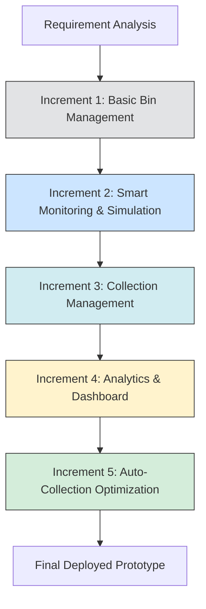
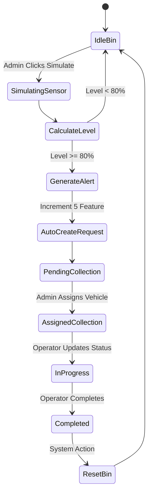
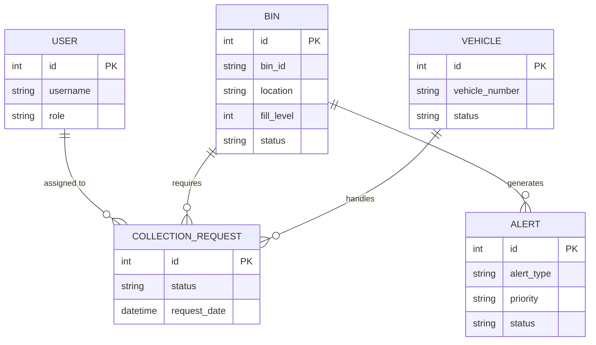

# System Diagrams

This document contains Mermaid diagrams visualizing the architecture and flow of the Smart Waste Collection Monitoring System.

## 1. Incremental Development Flow



## 2. Use Case Diagram

```mermaid
usecase
    actor Admin
    actor Operator
    actor SystemTimer
    
    usecase "Login" as UC1
    usecase "Manage Waste Bins" as UC2
    usecase "View Dashboard/Analytics" as UC3
    usecase "Simulate Sensor Data" as UC4
    usecase "Assign Vehicles" as UC5
    usecase "Update Collection Status" as UC6
    usecase "Auto-generate Alerts" as UC7
    
    Admin --> UC1
    Admin --> UC2
    Admin --> UC3
    Admin --> UC4
    Admin --> UC5
    
    Operator --> UC1
    Operator --> UC6
    
    SystemTimer --> UC7
    UC4 -.->|Triggers| UC7
```

## 3. System Flow Activity Diagram



## 4. Entity Relationship (ER) Diagram


